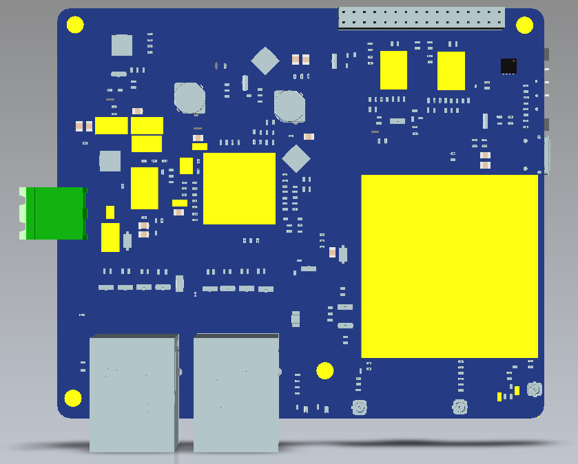
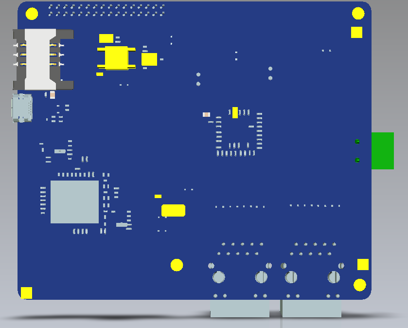
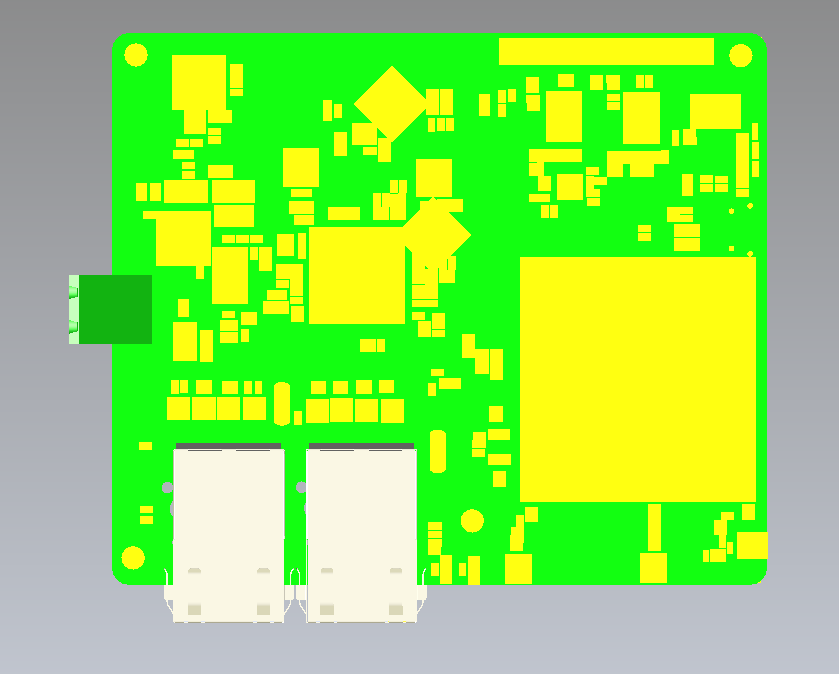
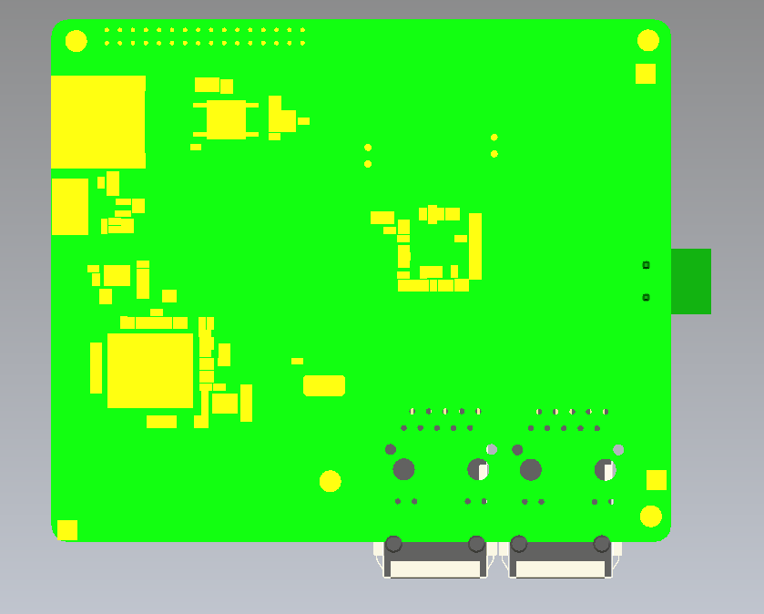

# JayBox Mortherboard CAD file
The Jaybox motherboard CAD files is a part of JEIQI Open project: [https://jieqi.io/open.html](https://jieqi.io/open.html), 

## 1. Jaybox-mainboard-realpartsV4.0. stp

Some components have been replaced with real parts, looks better if you want render your own motherboard pictures. 

 
    
    
## 2. Jaybox-mainboard.stp

Componets are displayed like blocks only for refenceren, it is enough to design a case.

 
    

If you have any questions, contact: [open@jieqi.io](open@jieqi.io.).

## Buy a JayBox Develop Board

[https://item.taobao.com/item.htm?id=631074665039](https://item.taobao.com/item.htm?id=631074665039)